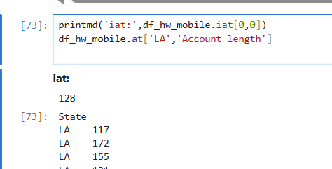
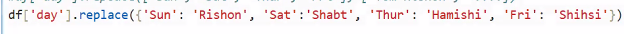

# dataScience-Pandas-Lec7-2n3-MAR-25
Pandas - continue
* iat[row_index,col_index]= access/set single value by indexes, like cell[row_i][col_i]
* at[row_label,col_label]= access/set single value by labels. 
  * if there are more the one values will return all
  * df_hw_mobile.at['LA','Account length'] = df_hw_mobile.loc['LA']['Account length']
  
* set_index(label): the values must be uniques. 
* df.is_unique= attribute - return false if the values is not unique
* unique()= return values without duplicates 
* nunique()= count how many unique values we have=len(df['day']).unique()
* values_counts(options=sort,asc)= works on series/dataframe,return Series of count for each value,(key=value, value=count).
  * df['day'].values_counts()
  * df['day','sex'].values_counts()
  * df[['day','sex']].values_counts()
* duplicated()= page 11-return for each value by column : if duplicated or not
  * only after first instance, return the other duplicated=true
  * df['size'].duplicated()
  * ~df['size'].duplicated()=df['size'].unique()
* drop_duplicated()=  page 11- remove all rows with duplicated values from the df
  * inplace=optional
* len(df)/len(df[label])= length total values/length of values in given label
* sort_values(<by= optional>label/[label1,label2], ascending=boolean/[boolean1,boolean2])=sort values
* replace(dictionary or fromValue=string/[fromValue1,fromValue2],toValue=string/[toValue1,toValue2]) (page 9/26)= works on column:
  * 1 column:
    * df['sex'].replace('Female','F')
    * df['sex'].replace(['Female','Male],['F','M'])
    * or with dictionary:
    
  * on many columns: df.replace(dictionary={'day':{'san':1,...},'sex':{...}})
* map(dictionary)= like replace, receive dictionary with mapping on 1 column
  * works only on 1 column 
  * if there is no match for the fromValue, the toValue will be NaN
  * if run value_counts() on map: return only of Not NaN values
* nlargest(number of row,label,nsmallerst-page 12
* samples(number of row,frac=in percentage)= return random rows-page 12:
  * df.sample(5)= 5 rows randomly
  * df.sample(frac=0.1) 10% of the rows randomly